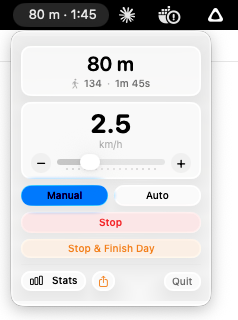
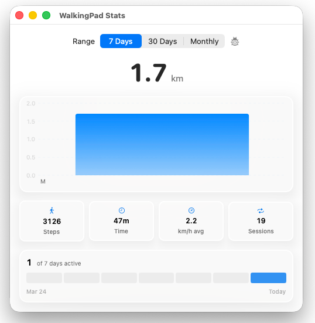

# WalkingPad macOS Client

A native macOS status-bar app for controlling and monitoring [WalkingPad](https://www.walkingpad.com/) treadmills over Bluetooth.

## Features

- **Bluetooth connection** — automatically discovers and connects to your WalkingPad treadmill
- **Step tracking** — accumulates steps, distance, and walking time across sessions
- **Speed control** — change speed directly from the menu bar (manual and automatic modes)
- **Health sync** — upload steps to Google Fit via the [HCGateway](https://github.com/ShuchirJ/HCGateway) bridge app
- **Statistics** — remembers past workouts and provides historical stats via an [external dashboard](https://walkingpad-stats.netlify.app)
- **[Alfred](https://www.alfredapp.com/) workflow** — control your treadmill by keystroke ([download workflow](https://github.com/klassm/walkingpad_alfred/releases))
- **MQTT publishing** — publish treadmill state for Home Assistant and other home automation tools
- **Local HTTP API** — REST endpoints for programmatic control and integration

## Installation

Download the latest release from the [releases section](https://github.com/klassm/walkingpad_macos_client/releases).

Grant the app Bluetooth permissions when prompted:


## Building from Source

1. Open `walkingpad-client.xcodeproj` in Xcode 16.3+
2. Dependencies are managed via Swift Package Manager and will resolve automatically
3. Build with Cmd+B, run with Cmd+R
4. The app appears in the menu bar (not the Dock)

**Note:** `project.pbxproj` is gitignored. On a fresh clone you may need to recreate Xcode project settings and re-add source files to the target.

### Dependencies

| Package | Version | Purpose |
|---------|---------|---------|
| [Embassy](https://github.com/envoy/Embassy) | 4.1.6 | Embedded HTTP server for the local API |
| [mqtt-nio](https://github.com/sroebert/mqtt-nio) | 2.8.1 | MQTT client for Home Assistant integration |
| [swift-nio](https://github.com/apple/swift-nio) | 2.84.0 | Network I/O (mqtt-nio dependency) |

## Screenshots




## HTTP API

The app runs a local HTTP server on **port 4934** for Alfred workflow integration and external tools.

### Endpoints

| Method | Path | Description |
|--------|------|-------------|
| GET | `/treadmill` | Current state: steps, distance, walkingSeconds, speed (km/h) |
| GET | `/treadmill/workouts` | Historical workout data (up to 500 entries) |
| POST | `/treadmill/start` | Start the treadmill |
| POST | `/treadmill/stop` | Stop the treadmill (set speed to 0) |
| POST | `/treadmill/faster` | Increase speed by 0.5 km/h |
| POST | `/treadmill/slower` | Decrease speed by 0.5 km/h |
| POST | `/treadmill/speed/{10-80}` | Set specific speed (multiples of 10, e.g., `/speed/30` = 3.0 km/h) |

### Example

```bash
# Get current treadmill state
curl http://localhost:4934/treadmill

# Start walking at 3.0 km/h
curl -X POST http://localhost:4934/treadmill/start
curl -X POST http://localhost:4934/treadmill/speed/30
```

Returns 428 if treadmill is not connected.

## MQTT Configuration

Publish the current treadmill state as MQTT messages for home automation (Home Assistant, etc.).

Create a config file at:
```
~/Library/Containers/klassm.walkingpad-client/Data/Library/Autosave Information/.walkingpad-client-mqtt.json
```

```json
{
  "username": "myusername",
  "password": "mypassword",
  "host": "192.168.0.73",
  "port": 1883,
  "topic": "homeassistant/sensor/walkingpad"
}
```

The app reads this on startup and publishes messages on speed changes (or every 30 seconds):

```json
{
  "speedKmh": 1.5,
  "stepsTotal": 19202,
  "distanceTotal": 4690,
  "stepsWalkingpad": 510
}
```

### Home Assistant Example

```yaml
mqtt:
  sensor:
    - name: "WalkingPad Speed"
      object_id: "walkingpad_speed"
      state_topic: "homeassistant/sensor/walkingpad"
      value_template: "{{ value_json.speedKmh }}"
      unit_of_measurement: "km/h"
    - name: "WalkingPad Steps"
      object_id: "walkingpad_steps"
      state_topic: "homeassistant/sensor/walkingpad"
      value_template: "{{ value_json.stepsTotal }}"
      unit_of_measurement: "Steps"
```

## Health Sync (HCGateway)

To sync steps to Google Fit:

1. Install the [HCGateway](https://github.com/ShuchirJ/HCGateway) bridge app on your phone
2. Create an account and connect Google Fit
3. Click "Login" in the WalkingPad app footer
4. Enter the same credentials you used for HCGateway

Steps are automatically uploaded when you stop or pause the treadmill (minimum 10 steps).

## Project Structure

```
walkingpad-client/
├── walkingpad_clientApp.swift     # App entry point + AppDelegate
├── models/                        # Data types (DeviceState, Change, WorkoutSaveData)
├── services/
│   ├── walkingPad/
│   │   ├── WalkingPadService.swift    # BLE state + notification parsing
│   │   └── WalkingPadCommand.swift    # BLE write commands
│   ├── BluetoothDiscoveryService.swift
│   ├── BluetoothPeripheral.swift
│   ├── Workout.swift              # Step accumulation + persistence
│   ├── HttpApi.swift              # Local HTTP server (port 4934)
│   ├── MqttService.swift          # MQTT publishing
│   ├── HCGatewayService.swift     # Health sync auth + orchestration
│   ├── HCGatewayFacade.swift      # HCGateway REST client
│   ├── StepsUploader.swift        # Batched step upload trigger
│   ├── FileSystem.swift           # JSON file persistence
│   └── RepeatingTimer.swift       # Polling timer
├── views/                         # SwiftUI views
└── utils/                         # Date extension helper
```

For detailed technical documentation, see [ARCHITECTURE.md](ARCHITECTURE.md).
For known bugs and improvement areas, see [KNOWN_ISSUES.md](KNOWN_ISSUES.md).

## Credits

The BLE protocol implementation is inspired by [ph4r05/ph4-walkingpad](https://github.com/ph4r05/ph4-walkingpad).

## License

[Apache License 2.0](LICENSE)
